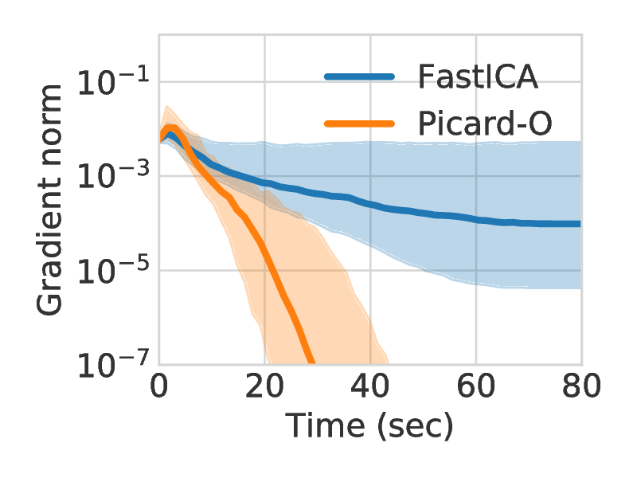

Picard : Preconditioned ICA for Real Data
=========================================

|Travis|_ |Codecov|_ |Downloads|_

.. |Travis| image:: https://api.travis-ci.org/pierreablin/picard.svg?branch=master
.. _Travis: https://travis-ci.org/pierreablin/picard

.. |Codecov| image:: http://codecov.io/github/pierreablin/picard/coverage.svg?branch=master
.. _Codecov: http://codecov.io/github/pierreablin/picard?branch=master

.. |Downloads| image:: http://pepy.tech/badge/python-picard
.. _Downloads: http://pepy.tech/project/python-picard

This repository hosts Python/Octave/Matlab code of the Preconditioned ICA
for Real Data (Picard) and Picard-O algorithms.

See the `documentation <https://pierreablin.github.io/picard/index.html>`_.

Algorithm
---------

Picard is an algorithm for maximum likelihood independent component analysis.
It shows state of the art speed of convergence, and solves the same problems as the widely used FastICA, Infomax and extended-Infomax, faster.

The parameter `ortho` choses whether to work under orthogonal constraint (i.e. enforce the decorrelation of the output) or not.
It also comes with an extended version just like extended-infomax, which makes separation of both sub and super-Gaussian signals possible.
It is chosen with the parameter `extended`.

* `ortho=False, extended=False`: same solution as Infomax
* `ortho=False, extended=True`: same solution as extended-Infomax
* `ortho=True, extended=True`: same solution as FastICA
* `ortho=True, extended=False`: finds the same solutions as Infomax under orthogonal constraint.

Installation
------------

To install the package, the simplest way is to use pip to get the latest release::

  $ pip install python-picard

or to get the latest version of the code::

  $ pip install git+https://github.com/pierreablin/picard.git#egg=picard

The Matlab/Octave version of Picard and Picard-O is `available here <https://github.com/pierreablin/picard/tree/master/matlab_octave>`_.

Quickstart
----------

To get started, you can build a synthetic mixed signals matrix:

.. code:: python

   >>> import numpy as np
   >>> N, T = 3, 1000
   >>> S = np.random.laplace(size=(N, T))
   >>> A = np.random.randn(N, N)
   >>> X = np.dot(A, S)

And then use Picard to separate the signals:

.. code:: python

   >>> from picard import picard
   >>> K, W, Y = picard(X)

Picard outputs the whitening matrix, K, the estimated unmixing matrix, W, and
the estimated sources Y. It means that:

.. math::

    Y = W K X

Dependencies
------------

These are the dependencies to use Picard:

* numpy (>=1.8)
* matplotlib (>=1.3)
* numexpr (>= 2.0)
* scipy (>=0.19)

These are the dependencies to run the EEG example:

* mne (>=0.14)

Cite
----

If you use this code in your project, please cite::

    Pierre Ablin, Jean-Francois Cardoso, Alexandre Gramfort
    Faster independent component analysis by preconditioning with Hessian approximations
    IEEE Transactions on Signal Processing, 2018
    https://arxiv.org/abs/1706.08171

    Pierre Ablin, Jean-François Cardoso, Alexandre Gramfort
    Faster ICA under orthogonal constraint
    ICASSP, 2018
    https://arxiv.org/abs/1711.10873
